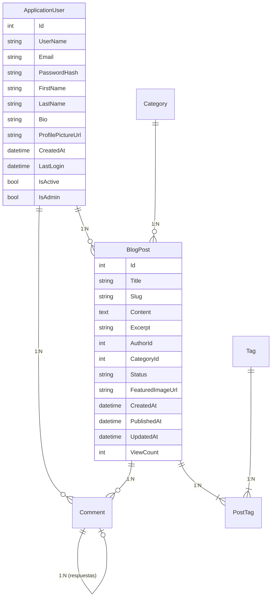

# 📝 BlogPlatform - Database Schema

Este repositorio contiene el **esquema completo de base de datos** para una plataforma de blogs, diseñada para integrarse con aplicaciones **.NET** y SQL Server.

---

## 📚 Descripción General

El esquema incluye soporte para:

- Gestión de usuarios con autenticación y roles.
- Publicaciones con categorías, etiquetas y estado.
- Sistema de comentarios con moderación y respuestas anidadas.
- URLs amigables mediante slugs únicos.
- Validación de datos a nivel de base de datos.

# 🏗️ Estructura de la Base de Datos

## 👥 ApplicationUser (Usuarios)

**Descripción**: Almacena cuentas de usuarios registrados  
**Campos**:

- `Id` INT PK (Identificador único)
- `UserName` NVARCHAR(50) UNIQUE (Nombre de usuario único)
- `Email` NVARCHAR(100) UNIQUE (Validado)
- `PasswordHash` NVARCHAR(255) (Contraseña encriptada)
- `FirstName`/`LastName` NVARCHAR(50) (Nombres opcionales)
- `Bio` NVARCHAR(500) (Biografía)
- `ProfilePictureUrl` NVARCHAR(255) (URL de imagen)
- `CreatedAt` DATETIME2 (Fecha creación)
- `LastLogin` DATETIME2 (Último acceso)
- `IsActive` BIT (Usuario activo)
- `IsAdmin` BIT (Permisos admin)

**Restricciones**:

- Validación de formato email (`CK_ApplicationUser_Email`)

## 📂 Category (Categorías)

**Descripción**: Clasificación principal de contenido  
**Campos**:

- `Id` INT PK
- `Name` NVARCHAR(50) UNIQUE
- `Description` NVARCHAR(255)
- `Slug` NVARCHAR(60) UNIQUE (URL amigable)

## ✍️ BlogPost (Publicaciones)

**Descripción**: Contenido principal del blog  
**Campos**:

- `Id` INT PK
- `Title` NVARCHAR(120) (Título)
- `Slug` NVARCHAR(130) UNIQUE (URL única)
- `Content` NVARCHAR(MAX) (Contenido completo)
- `Excerpt` NVARCHAR(300) (Resumen)
- `AuthorId` INT FK → ApplicationUser (Autor)
- `CategoryId` INT FK → Category (Categoría)
- `Status` NVARCHAR(20) (Estado: draft/published/archived)
- `FeaturedImageUrl` NVARCHAR(255) (Imagen destacada)
- `CreatedAt`/`PublishedAt`/`UpdatedAt` DATETIME2 (Fechas)
- `ViewCount` INT (Visitas)

## 🏷️ Tag (Etiquetas)

**Descripción**: Clasificación secundaria  
**Campos**:

- `Id` INT PK
- `Name` NVARCHAR(50) UNIQUE
- `Slug` NVARCHAR(60) UNIQUE

## 🔗 PostTag (Relación Post-Etiqueta)

**Descripción**: Relación muchos-a-muchos  
**Campos**:

- `PostId` INT PK/FK → BlogPost
- `TagId` INT PK/FK → Tag

## 💬 Comment (Comentarios)

**Descripción**: Sistema de comentarios  
**Campos**:

- `Id` INT PK
- `PostId` INT FK → BlogPost
- `UserId` INT FK → ApplicationUser (opcional)
- `ParentCommentId` INT FK → Comment (respuestas)
- `AuthorName` NVARCHAR(100) (Invitados)
- `AuthorEmail` NVARCHAR(100) (Invitados)
- `Content` NVARCHAR(1000)
- `IsApproved` BIT (Aprobación)
- `CreatedAt` DATETIME2
- `IpAddress` NVARCHAR(45)

**Restricciones**:

- Validación comentarios invitados (`CK_Comment_Author`)

# 🔍 Diagrama Entidad-Relación (MER)



# 📊 Consultas SQL para **BlogPlatform**

Este documento reúne un conjunto de consultas SQL organizadas por categorías, diseñadas para interactuar con la base de datos de **BlogPlatform**.  
Incluye consultas básicas, relacionales, analíticas, de mantenimiento y más.

---

# 📊 Consultas SQL para BlogPlatform

## 🔍 Consultas Básicas

### 1️. Usuarios Activos

```sql
SELECT
    Id AS 'ID',
    UserName AS 'Usuario',
    Email AS 'Email',
    CONCAT(FirstName, ' ', LastName) AS 'Nombre',
    CreatedAt AS 'Registro'
FROM ApplicationUser
WHERE IsActive = 1
ORDER BY CreatedAt DESC;
```

### 2. Publicaciones Recientes

```sql
SELECT
    bp.Id AS 'ID',
    bp.Title AS 'Título',
    c.Name AS 'Categoría',
    au.UserName AS 'Autor',
    bp.PublishedAt AS 'Publicación'
FROM BlogPost bp
JOIN ApplicationUser au ON bp.AuthorId = au.Id
LEFT JOIN Category c ON bp.CategoryId = c.Id
WHERE bp.Status = 'published'
ORDER BY bp.PublishedAt DESC;
```

## 🔗 Consultas Relacionales

### 3. Publicaciones con Comentarios

```sql
SELECT
    bp.Id AS 'PostID',
    bp.Title AS 'Título',
    COUNT(co.Id) AS 'TotalComentarios',
    ISNULL(AVG(CAST(LEN(co.Content) AS FLOAT)), 0) AS 'Promedio Longitud Comentarios'
FROM BlogPost bp
LEFT JOIN Comment co ON bp.Id = co.PostId
GROUP BY bp.Id, bp.Title
ORDER BY COUNT(co.Id) DESC;
```

### 4. Detalle de Publicación

```sql
SELECT
    bp.Title,
    au.UserName AS Autor,
    c.Name AS Categoría,
    STRING_AGG(t.Name, ', ') AS Etiquetas,
    bp.Content
FROM BlogPost bp
JOIN ApplicationUser au ON bp.AuthorId = au.Id
LEFT JOIN Category c ON bp.CategoryId = c.Id
LEFT JOIN PostTag pt ON bp.Id = pt.PostId
LEFT JOIN Tag t ON pt.TagId = t.Id
WHERE bp.Id = 1
GROUP BY bp.Title, au.UserName, c.Name, bp.Content;
```

## 📈 Consultas Analíticas

### 5. Estadísticas por Categoría

```sql
SELECT
    c.Name AS Categoría,
    COUNT(bp.Id) AS Posts,
    AVG(bp.ViewCount) AS AvgVisitas,
    SUM(bp.ViewCount) AS TotalVisitas
FROM Category c
LEFT JOIN BlogPost bp ON c.Id = bp.CategoryId
GROUP BY c.Name
ORDER BY COUNT(bp.Id) DESC;
```

### 6. Actividad de Usuarios

```sql
SELECT
    au.UserName,
    COUNT(DISTINCT bp.Id) AS Posts,
    COUNT(DISTINCT co.Id) AS Comentarios,
    MAX(bp.PublishedAt) AS 'Último Post'
FROM ApplicationUser au
LEFT JOIN BlogPost bp ON au.Id = bp.AuthorId
LEFT JOIN Comment co ON au.Id = co.UserId
GROUP BY au.UserName
ORDER BY COUNT(DISTINCT bp.Id) DESC;
```

## 💬 Consultas de Comentarios

### 7. Comentarios Recientes

```sql
SELECT
    co.Id,
    bp.Title AS Post,
    CASE
        WHEN co.UserId IS NULL THEN co.AuthorName + ' (Invitado)'
        ELSE au.UserName
    END AS Autor,
    LEFT(co.Content, 100) + '...' AS Contenido,
    co.CreatedAt
FROM Comment co
JOIN BlogPost bp ON co.PostId = bp.Id
LEFT JOIN ApplicationUser au ON co.UserId = au.Id
ORDER BY co.CreatedAt DESC;
```

### 8. Hilos de Comentarios

```sql
WITH CommentCTE AS (
    SELECT
        Id, Content, ParentCommentId, CreatedAt,
        CAST(ROW_NUMBER() OVER(ORDER BY CreatedAt) AS VARCHAR(MAX)) AS ThreadPath
    FROM Comment
    WHERE ParentCommentId IS NULL

    UNION ALL

    SELECT
        c.Id, c.Content, c.ParentCommentId, c.CreatedAt,
        CAST(ct.ThreadPath + '.' + CAST(ROW_NUMBER() OVER(
            PARTITION BY c.ParentCommentId ORDER BY c.CreatedAt
        ) AS VARCHAR(MAX)) AS VARCHAR(MAX))
    FROM Comment c
    JOIN CommentCTE ct ON c.ParentCommentId = ct.Id
)
SELECT
    REPLICATE('  ', LEN(ThreadPath) - LEN(REPLACE(ThreadPath, '.', ''))) + Content AS Comentario,
    CreatedAt
FROM CommentCTE
ORDER BY ThreadPath;
```

## 🏷️ Consultas de Etiquetas

### 9. Nube de Etiquetas

```sql
SELECT
    t.Name AS Etiqueta,
    COUNT(pt.PostId) AS Uso,
    CASE
        WHEN COUNT(pt.PostId) > 10 THEN 'lg'
        WHEN COUNT(pt.PostId) > 5 THEN 'md'
        ELSE 'sm'
    END AS 'Tamaño'
FROM Tag t
JOIN PostTag pt ON t.Id = pt.TagId
GROUP BY t.Name
ORDER BY COUNT(pt.PostId) DESC;
```

### 10. Publicaciones por Etiqueta

```sql
SELECT
    t.Name AS Etiqueta,
    bp.Title AS Post,
    au.UserName AS Autor,
    bp.PublishedAt
FROM Tag t
JOIN PostTag pt ON t.Id = pt.TagId
JOIN BlogPost bp ON pt.PostId = bp.Id
JOIN ApplicationUser au ON bp.AuthorId = au.Id
WHERE t.Name = 'Programming'
ORDER BY bp.PublishedAt DESC;
```

## 📌 Consultas de Mantenimiento

### 11. Posts sin Categoría

```sql
SELECT
    Id,
    Title,
    CreatedAt
FROM BlogPost
WHERE CategoryId IS NULL
AND Status = 'published'
ORDER BY CreatedAt DESC;
```

### 12. Comentarios sin Aprobar

```sql
SELECT
    co.Id,
    bp.Title AS Post,
    CASE
        WHEN co.UserId IS NULL THEN co.AuthorName
        ELSE au.UserName
    END AS Autor,
    LEFT(co.Content, 50) + '...' AS Preview
FROM Comment co
JOIN BlogPost bp ON co.PostId = bp.Id
LEFT JOIN ApplicationUser au ON co.UserId = au.Id
WHERE co.IsApproved = 0
ORDER BY co.CreatedAt;
```
